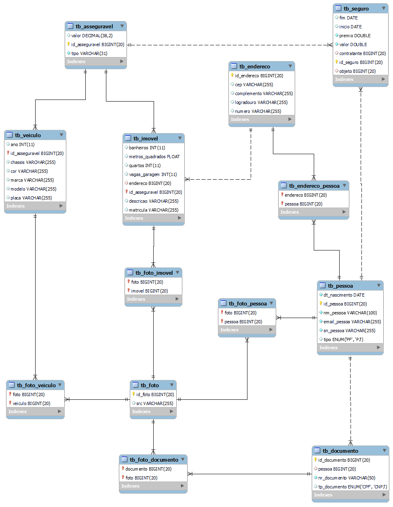
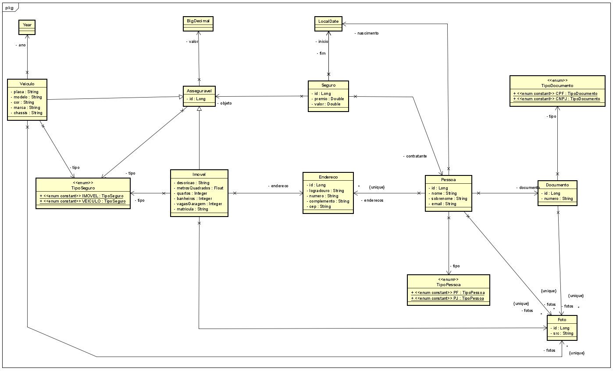
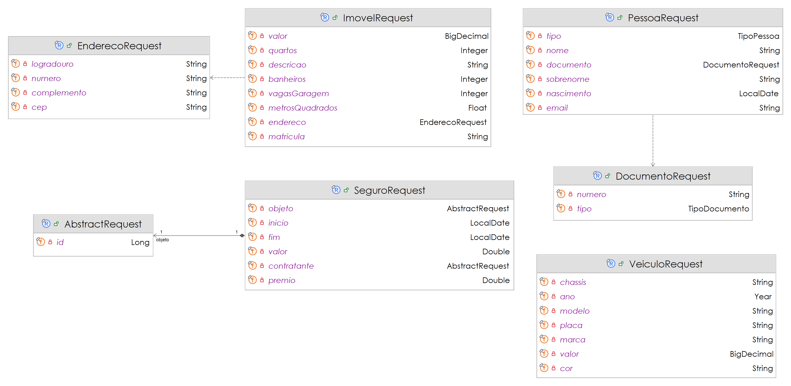
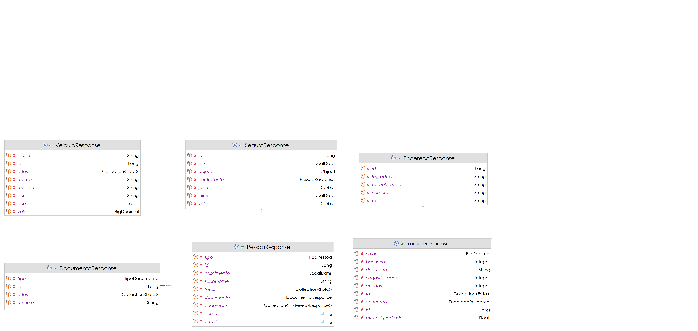

# 🏡 | 🚗  🤓👍🏽 Seguradora Benezinho's


CP III - **Java Advanced** aplicado em 20/05/2024.

|                | **Java Advanced** |
|------------------------------------------|-------------------|
| **ALUNO:**                               | **TURMA:** 2TDSPF |
| **PROFESSOR:** Benefrancis do Nascimento | 20/05/2024        |
| **CP III**                               | ****              |

# Sumário

[Estudo de caso ](#_Estudo_de_caso)

[O que deverá ser feito? ](#_O_que_devera_ser_feito)

[Diagrama de Classes ](#_Diagrama_de_Classes)

[Como Entregar ](#_Entrega)

[Correção da Prova ](#_Correcao)

<a id="_Estudo_de_caso"></a>

# Estudo de caso

A Holding Benezinho deseja investir no ramo de seguros no Brasil, Com o objetivo de fazer este negócio dar certo, idealizamos o desenvolvimento de um Sistema para Gestão dos Seguros da Seguradora.

Criaremos, nesta aula, um Produto Mínimo Viável (PMV) de uma API Rest para o sistema que alimentará, entre outras, as tabelas do Diagrama exibido abaixo:

## Diagrama de Entidade e Relacionamento



Nossoa Analistas de Sistemas e Arquitetos de Softwre desenvolveram os Diagramas de Classes abaixo:

## Diagrama de Classes de Entidade



## Diagrama de Classes de Request (DTO's)



## Diagrama de Classes de Response (DTO's)



## Tecnologias utilizadas no projeto

1. Java
2. Spring Boot (Spring Data, Hateoas)
3. JPA, Hibernate
4. Relational Database
5. Templates Thymeleaf
6. HTML
7. CSS
8. JavaScript
9. Postman
10. Bean Validation
11. Spring Security

A sua missão aqui é realizar o Mapeamento Objeto Relacional das classes de Entidade. 
Usaremos a JPA e o Hibernate como ferramentas de Mapeamento Objeto Relacional.

<a id="_O_que_devera_ser_feito"></a>

# O que deverá ser feito?

**Você deverá:**

**Fazer o fork do projeto do github.**:

[https://github.com/Benefrancis/spring-cp3-2tds-seguradora](https://github.com/Benefrancis/spring-cp3-2tds-seguradora)

Caso o github esteja indisponível, você deverá pegar o projeto no diretório compartilhado.

Alterar o arquivo contido em  **documentos/equipe.txt** para incluir os RMs e nome da **dupla**. 

Caso tenham recebido algum ponto por participação nas aulas informe neste arquivo. 

**Não aceitarei de outra forma ou reclamações posteriores**.

**OBS:** Será com base nos nomes contidos neste aquivo que eu irei atribuir a nota.

1. **(4,25 Pontos)** O Mapeamento Objeto Relacional das primeiras classes envolvidas neste projeto de software (classes do
   pacote entity). Essas classes deverão ser capazes de fazer a criação automatizada das tabelas no banco de dados Oracle, gerar
   constraints inteligíveis (atenção com as FKs e Uks) e não permitir redundância de informações importantes para o negócio. 
   A criação dos DTOs (Objetos de Transferência de Dados) de Request e de Response, bem como Os Respectivos Services que devem implementar ServiceDTO (exceto Foto Service). Os repositories foram fornecidos.

    1. **(0,5 Ponto)** - **Documento**, **DocumentoRequest**, **DocumentoResponse** e **DocumentoService** - Documentos com tipo e numero repetidos não devem ser aceitos pelo banco de dados
    2. **(0,5 Ponto)** - **Asseguravel** - Atenção com mapemanto de Herança utilize a estratégia Joined 
    3. **(0,5 Ponto)** - **Veiculo**, **VeiculoRequest**, **VeiculoResponse** e **VeiculoService**  - Veículo com o chassis repetido não devem ser aceitos pelo banco de dados. Não deve ser exibido o chassis como responsta as requisições.
    4. **(0,5 Ponto)** - **Imovel**, **ImovelRequest**, **ImovelResponse** e **ImovelService**    - Imóvel com matricula repetida não devem ser aceitos pelo banco de dados. Não deve ser exibida matricula do imóvel na responsta das requisições. Um novo endereço é cadastrado no momento em que se cadastrar o imovel.
    5. **(0,25 Ponto)** - **Pessoa**, **PessoaRequest**, **PessoaResponse**  e **PessoaService**   - Pessoa com email repetido não devem ser aceitos pelo banco de dados. Email deve ser obriatório e validado na requisição. Um novo Documento deve ser cadastrado no momento em que se cadastrar a pessoa.
    6. **(0,25 Ponto)** - **Endereco**, **EnderecoRequest**, **EnderecoResponse**  e **EnderecoService**   - CEP deve ser obriatório e validado na requisição
    7. **(1 Ponto)** - **Seguro** , **SeguroRequest**, **SeguroResponse** e **SeguroService**
    8. **(0,25 Ponto)** - **AbstractRequest** Utilização correta nas situções que forem necessário utilziar.
    9. **(1 Ponto)** - **Foto** e **FotoService** - Deverá ser capaz de fazer upload de Fotos e salválas no diretório **drive/fotos**.


2. **(6,25 Pontos)** A criação dos Seguintes Resources que devem implementar a ResourceDTO (foi fornecida):

    1. **PessoaResource** com as seguintes ROTAS e VERBOS (**1,5**):
        1. **(0,25 Ponto)** "localhost/pessoas" - **POST**
        2. **(0,5 Ponto)** "localhost/pessoas" - **GET by Example**,
        3. **(0,25 Ponto)** "logalhost/pessoas/{id}" - **GET**
        4. **(0,25 Ponto)** "logalhost/pessoas/{id}/fotos" - **POST**
        5. **(0,25 Ponto)** "logalhost/pessoas/{id}/enderecos" - **POST**

    2. **SeguroResource** com as seguintes ROTAS e VERBOS (**1**):
        1. **(0,25 Ponto)** "localhost/seguros" - **POST**
        2. **(0,5 Ponto)** "localhost/seguros" - **GET by Example**,
        3. **(0,25 Ponto)** "logalhost/seguros/{id}" - **GET**

    3. **VeiculoResource** com as seguintes ROTAS e VERBOS (**1,25**):
        1. **(0,25 Ponto)** "localhost/veiculos" - **POST**
        2. **(0,5 Ponto)** "localhost/veiculos" - **GET by Example**,
        3. **(0,25 Ponto)** "logalhost/veiculos/{id} - **GET**
        4. **(0,25 Ponto)** "logalhost/veoculos/{id}/fotos" - **POST**

   4. **ImovelResource** com as seguintes ROTAS e VERBOS (**1,25**):
       1. **(0,25 Ponto)** "localhost/imoveis" - **POST**
       2. **(0,5 Ponto)** "localhost/imoveis" - **GET by Example**,
       3. **(0,25 Ponto)** "logalhost/imoveis/{id} - **GET**
       4. **(0,25 Ponto)** "logalhost/veiculos/{id}/fotos" - **POST**

   5. **DocumentoResource** com as seguintes ROTAS e VERBOS (**1,25**):
       1. **(0,25 Ponto)** "localhost/documentos" - **POST**
       2. **(0,5 Ponto)** "localhost/documentos" - **GET by Example**,
       3. **(0,25 Ponto)** "logalhost/documentos/{id} - **GET**
       4. **(0,25 Ponto)** "logalhost/documentos/{id}/fotos" - **POST**


3. **(2 PONTOS)** - Execução dos Testes com o **POSTMAN**:
   A dupla deverá **criar e executar os testes  no POSTMAN** para todos os endpoints da aplicação (pelo menos três testes por Request/Entity), exportar os testes e
   colocar **o json gerado na exportação do POSTMAN** na pasta **documentação/requisicoes**. Receberá os pontos se o arquivo for fornecido e os testes realmente forem eficazes.

<a id="_Entrega"></a>

# Como Entregar

**A entrega deverá ser feita pelo Teams**, você deverá postar o arquivo compactado do projeto contendo todos os artefatos (receberá nota ZERO o aluno que postar apenas o link para o github [Não irei corrigir projetos no github]). Porém não se esqueça de fazer o **commit** e **push** do projeto no github. Eu vou olhar se existe log para provar que você realmente implementou o código que está entregando.

**ATENÇÃO ---- MUITA ATENÇÃO**
**Não será aceito para correção o link para o projeto no github**. O aluno que entregar apenas o link receberá nota **ZERO**

<a id="_Correcao"></a>

# Correção da Prova

Nos próximos dias, a correção da prova será disponibilizada no github do professor (branch correcao):

Para acessar digite no prompt:

```shell
git clone https://github.com/Benefrancis/spring-cp3-2tds-seguradora && cd spring-cp3-2tds-seguradora && git checkout correcao
```

A avaliação é em **DUPLA** ( devido a grande quantidade de coisas para fazer Desenvolvimento, ORM, Testes e Documentação).

**Não copie, não forneça e nem aceite o código de outro aluno.**
O professor acessará o log do github e outras fontes para ver se a avaliação foi fraudada. Caso o arquivo compactado não tenha o log igual ao do github, a todos receberão nota **ZERO**
Em caso de fraude **de qualquer tipo** à atividade avaliativa, todos os envolvidos receberão nota **ZERO**

Boa avaliação.


Prof. Benefrancis do Nascimento